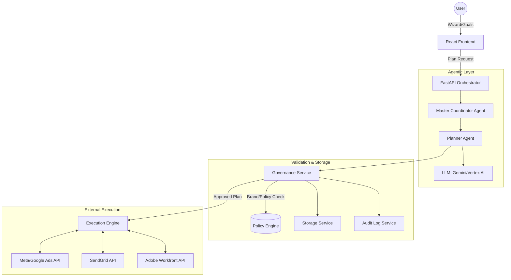

# AI-Driven Marketing Campaign Architecture

This document outlines the strategic architecture for the Agentic Marketing Platform, focusing on how AI agents enhance UI components and drive autonomous decision-making.

## 1. System Overview
The platform uses a **Master-Worker Agent Architecture** enhanced by a **Governance & Compliance Layer**. This ensures that AI decisions align with brand identity and budget constraints.

## 2. Component-Specific Agents
Each UI component is "enhanced" by a dedicated agent:

| Component | Agent Role | Enhancement Logic |
| :--- | :--- | :--- |
| **Dashboard** | Intelligence Summary | Aggregates cross-channel data to provide a "Natural Language" status report on the entire ecosystem. |
| **Campaigns** | Optimization Agent | Monitors campaign performance in real-time and suggests budget reallocations or creative pivots. |
| **Analytics** | Insight Engine | Performs predictive modeling to forecast future campaign ROI based on historical trends. |
| **Workfront** | Asset Orchestrator | Automates asset tagging, version control, and approval workflows within Adobe Workfront. |
| **AI Assistant**| Global Nav/Query | Provides a conversational interface for ad-hoc data retrieval and platform control. |

## 3. Data Sourcing & Decision Making
### Data Sources
1. **Behavioral Data**: Synced from Google Analytics and Pixel trackers.
2. **Engagement Data**: Derived from Social Media (Meta, LinkedIn) and Email (Mailchimp/SendGrid) APIs.
3. **Operational Data**: Pulled from Adobe Workfront (deadlines, asset availability, team bandwidth).
4. **CRM Data**: Customer segments and lifetime value metrics from Salesforce/HubSpot.

### 5. The "Profit Protection" Workflow (Sequence)
As seen in our refined sequence:
1. **User Input**: Marketer sets high-level goals (e.g., "Maximize ROI with $5k budget").
2. **Agent Planning**: The `Planner Agent` uses LLM to derive a cross-channel strategy.
3. **Governance Check**: The `Governance Service` validates the plan against brand guidelines and budget caps.
4. **Audit Logging**: Every AI-proposed change is logged in the `Audit Log Service` for transparency.
5. **Human Approval**: The marketer reviews and clicks **Launch**.
6. **Execution**: The `Execution Engine` pushes the plan to Meta, Google, and Email platforms simultaneously.
7. **Continuous Optimization**: The `Monitoring Agent` watches the performance and suggests mid-flight adjustments.
